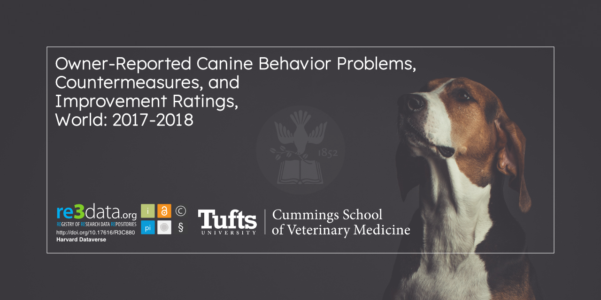

  

    
    
    
    

---

This is the data repository for the Pet Dog Behavior Series (PDBS) studies
conducted under the supervision of Dr. Nicholas Dodman from the Animal Behavior
Department of Clinical Sciences at the Cummings School of Veterinary Medicine at
Tufts University.

## Citation

TODO

## Project Structure

TODO
